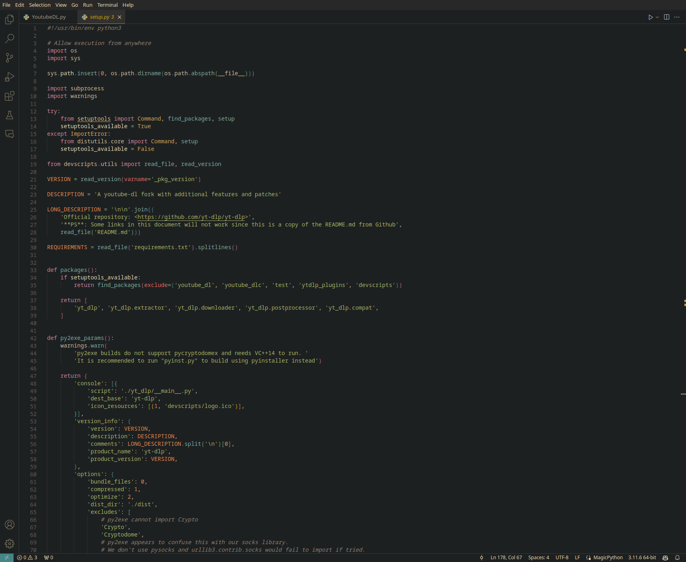
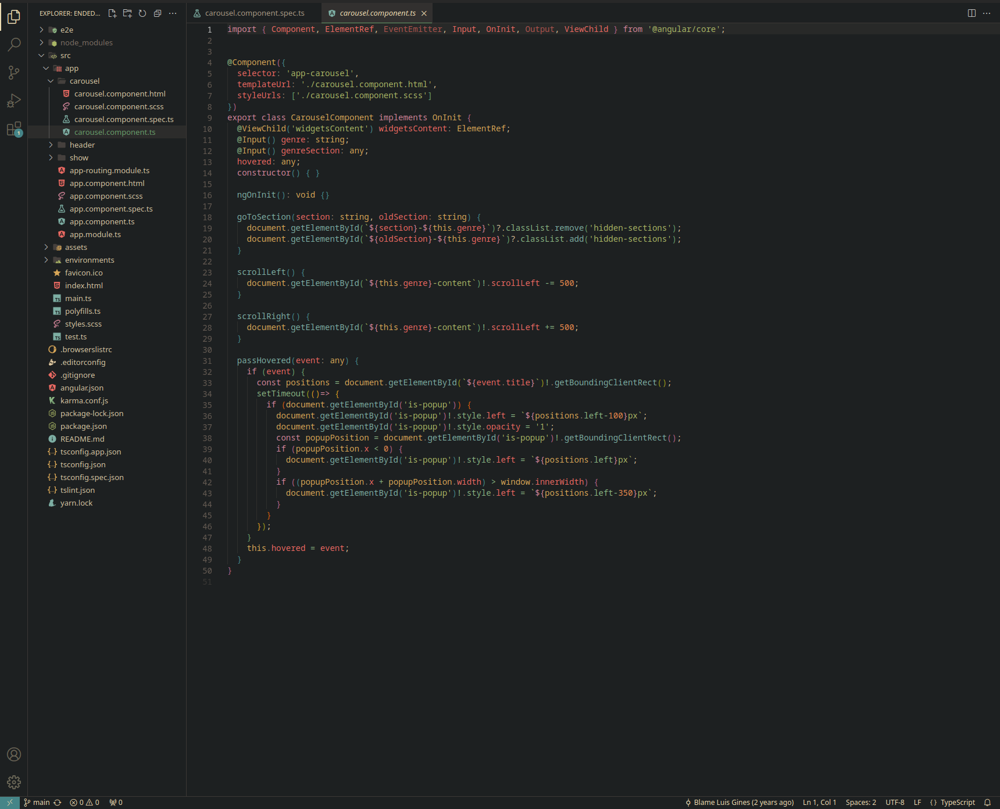

```
______            ______               
| ___ \           |  ___|              
| |_/ /_   _  __ _| |_ _ __ __ _  __ _ 
| ___ \ | | |/ _` |  _| '__/ _` |/ _` |
| |_/ / |_| | (_| | | | | | (_| | (_| |
\____/ \__,_|\__, \_| |_|  \__,_|\__, |
              __/ |               __/ |
             |___/               |___/ 
```

This VSCode theme is a combination of the [Gruvbox Material Dark Hard](https://github.com/sainnhe/gruvbox-material-vscode) and [One Dark Pro](https://github.com/Binaryify/OneDark-Pro) themes. The screenshots below use the [Gruvbox Material Icon Theme](https://marketplace.visualstudio.com/items?itemName=JonathanHarty.gruvbox-material-icon-theme)

***For Ruby: At the moment best used with Ruby LSP v0.5.5 :/ sorry***


### Screenshots





