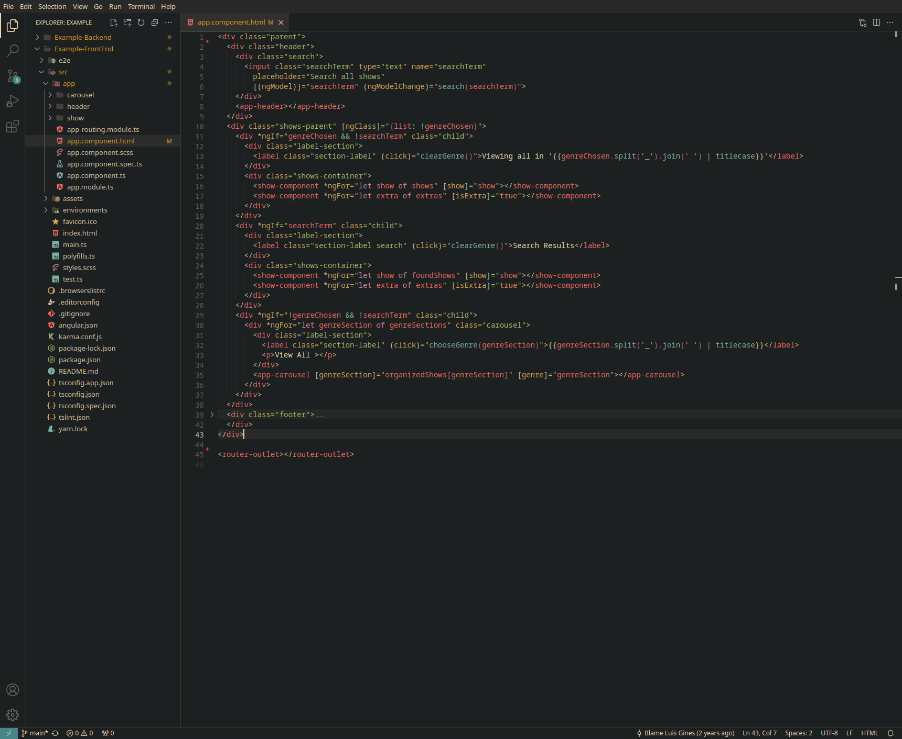
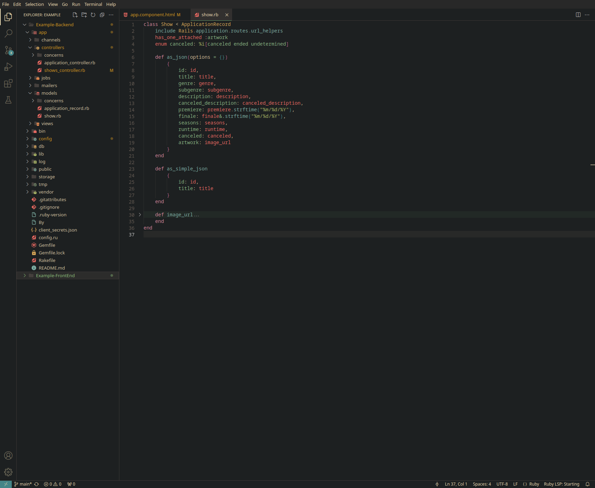

# 8ugFrag - A theme for VSCode

It is a combination of the [Gruvbox Material Dark Hard](https://github.com/sainnhe/gruvbox-material-vscode) and [One Dark Pro](https://github.com/Binaryify/OneDark-Pro) themes. The screenshots below use the [Gruvbox Material Icon Theme](https://marketplace.visualstudio.com/items?itemName=JonathanHarty.gruvbox-material-icon-theme)

### Screenshots

**Enjoy!**
